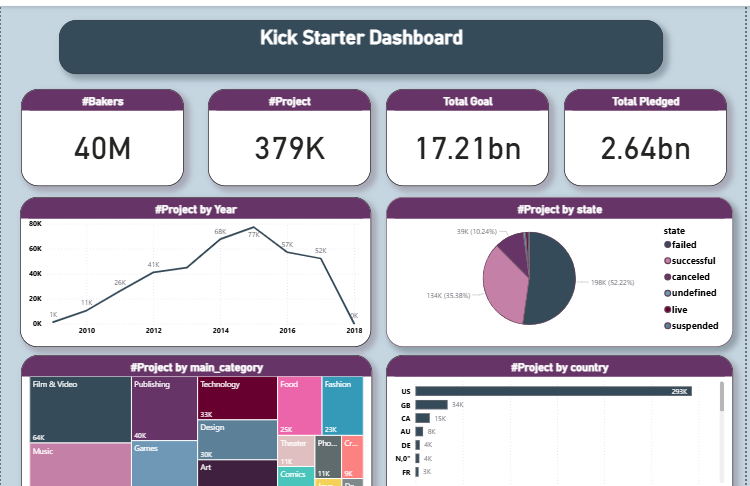

# 📊 Kickstarter Projects Data Analysis Dashboard

## 📝 وصف المشروع (Overview)
المشروع ده عبارة عن تحليل شامل لبيانات منصة **Kickstarter**. قمت بتحليل أكتر من 379 ألف مشروع لاستكشاف العوامل اللي بتأدي لنجاح أو فشل المشاريع الناشئة، وإزاي المبالغ المطلوبة (Goals) بتختلف عن المبالغ المدفوعة فعلياً (Pledged).

## 🚀 أهم النتائج (Key Insights)
* **نسبة النجاح:** حوالي **35.38%** فقط من المشاريع نجحت في الوصول لهدفها المالي.
* **الفجوة التمويلية:** إجمالي الأهداف المطلوبة كان **17.21 مليار دولار**، بينما ما تم دفعه فعلياً هو **2.64 مليار دولار**.
* **الفئات الأكثر انتشاراً:** فئات الـ **Film & Video** والـ **Publishing** هي الأكثر طلباً على المنصة.
* **التوزيع الجغرافي:** الولايات المتحدة الأمريكية (USA) تمتلك حصة الأسد بـ **293 ألف مشروع**.

## 🛠️ الأدوات المستخدمة (Tools)
* **الأداة الأساسية:** [Power BI ] لعمل التصميم والتحليل البصري.
* **تنظيف البيانات:** تم التعامل مع البيانات المفقودة (Missing values) وتنظيم الفئات.

## 🖼️ صورة لوحة البيانات (Dashboard Preview)

---

## 📂 محتويات المشروع
* `dashboard.png`: صورة المعاينة للوحة البيانات.
* `Kickstar.pbix`: ملف العمل الأساسي.

## 📫 تواصل معي
يسعدني تواصلكم معي لمناقشة تفاصيل المشروع على [LinkedIn] 
https://www.linkedin.com/in/shereen-talaat
